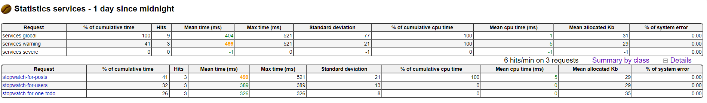

# Sample Configuration to Monitor a Spring Boot App with Java Melody's Stopwatch

The goal is to have measurements on how long does it take to run a specific part of the code, and display the result in `Java Melody` dashboard. 

## Configuration
```java
public class RestService {
    public void callRestAPIOne() {
        try (Stopwatch stopwatch = new Stopwatch("stopwatch-for-one-todo")) {
            try {
                HttpRequest request = HttpRequest.newBuilder().uri(new URI("https://jsonplaceholder.typicode.com/todos/1"))
                        .GET().build();
                System.out.println(HttpClient.newHttpClient().send(request, HttpResponse.BodyHandlers.ofString()).body());
            } catch (Exception ex) {
                ex.printStackTrace();
            }
        }
    }

    public void callRestAPITwo() {
        try (Stopwatch stopwatch = new Stopwatch("stopwatch-for-users")) {
            try {
                HttpRequest request = HttpRequest.newBuilder().uri(new URI("https://jsonplaceholder.typicode.com/users"))
                        .GET().build();
                System.out.println(HttpClient.newHttpClient().send(request, HttpResponse.BodyHandlers.ofString()).body());
            } catch (Exception ex) {
                ex.printStackTrace();
            }
        }
    }

    public void callRestAPIThree() {
        try (Stopwatch stopwatch = new Stopwatch("stopwatch-for-posts")) {
            try {
                HttpRequest request = HttpRequest.newBuilder().uri(new URI("https://jsonplaceholder.typicode.com/posts"))
                        .GET().build();
                System.out.println(HttpClient.newHttpClient().send(request, HttpResponse.BodyHandlers.ofString()).body());
            } catch (Exception ex) {
                ex.printStackTrace();
            }
        }
    }
}
```

## Result
